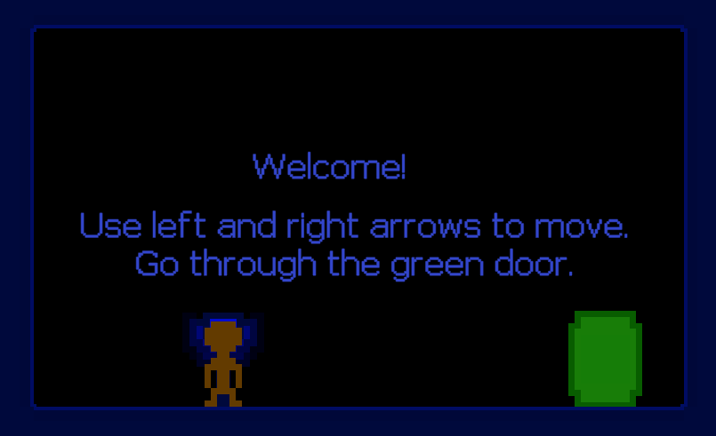
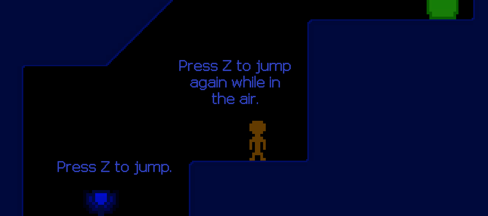
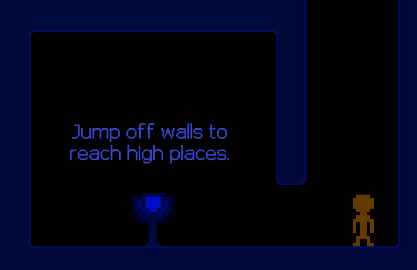
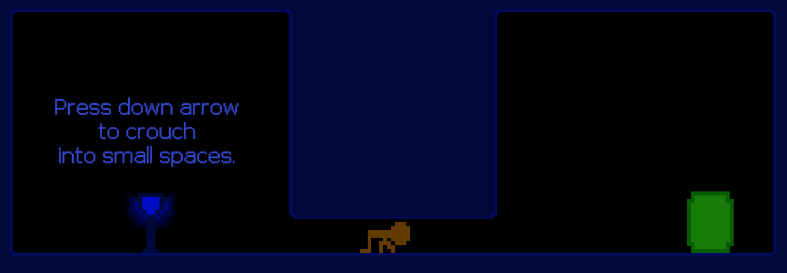
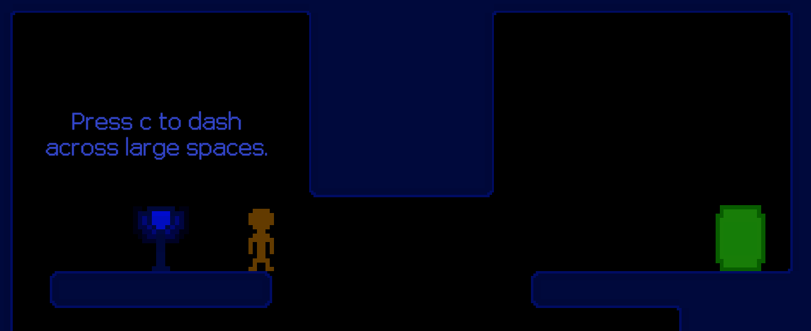
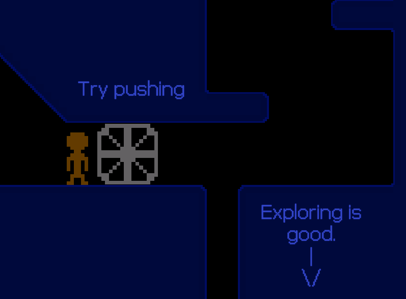

# 2D-Game
The objective of this assignment was to make a 2D game which used Unity's physics systems. The part of this project that I spent the most time on was the character controller. I had been playing a lot of Hollow Knight and wanted my character to have a similar feel. I wanted it to be snappy and responsive.

I had a hard time finding art for this game which was both free and consistent, so I made my own.

Unfortunately I created / found some bugs after this assignment was turned in and haven't spent the time to fix them.

[YouTube Video](https://youtu.be/_zQzk2WUO90)

